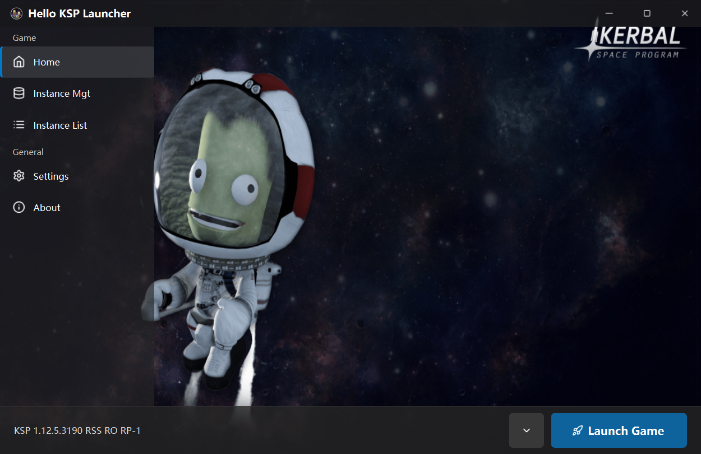
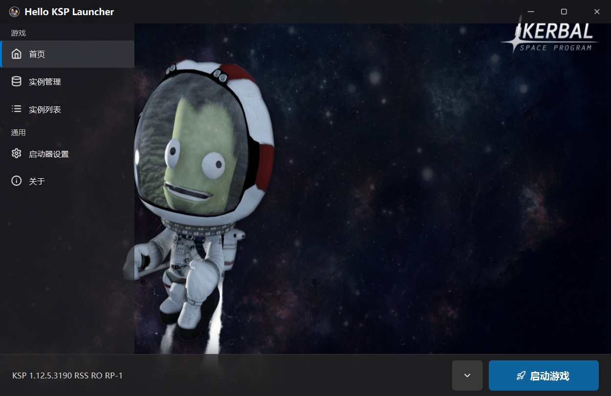

<p align="center">
  
</p>

# Hello KSP Launcher

[](LICENSE)


A modern, lightweight launcher for Kerbal Space Program — manage instances, tweak game settings, browse saves, and pack modpacks, all from a clean translucent UI.

---

**English** | [中文](#hello-ksp-launcher-中文)

---

## Features

- **Instance Management** — Add, rename, delete, and switch between multiple KSP installations with ease.
- **Steam Discovery** — On startup, automatically scans Steam libraries (via Windows registry + libraryfolders.vdf), finds KSP installations, and adds them to the instance list (named with the detected version, deduplicated by path).
- **One-Click Launch** — Launch your selected KSP instance immediately. Configurable post-launch behavior: keep the launcher open, minimize to tray, or auto-close.
- **Game Settings Editor** — Browse and edit KSP settings.cfg values in a tree view. Boolean values use a smooth toggle switch. Save changes directly.
- **Mod & DLC Detection** — Automatically list installed DLCs and third-party mods in the GameData directory.
- **Mod Management (CKAN)** — Install, upgrade, and uninstall mods from the CKAN repository with automatic dependency resolution (depends/recommends/suggests), strict KSP version compatibility checks based on your actual game version, and SHA256 integrity verification for every download.
- **Parallel Downloads** — Modules download concurrently (configurable up to 8 at a time) with a unified progress view and cancel button.
- **Mod Suggestions** — During installation, optional suggested mods (from the "suggests" field) are shown in a checkbox dialog; selected suggestions and their dependencies are resolved and installed automatically. Can be toggled in settings.
- **Flexible Sources & Cache** — Switch between official and mirror download sources, configure the index refresh interval, and manage the download cache folder (precise cleanup and cache migration).
- **Atomic Transactions** — Install, uninstall, and upgrade run as atomic transactions with automatic rollback on failure or cancellation, so no files are left behind and the registry is restored to its pre-operation state.
- **Save Management** — View all saves for an instance, inspect save metadata (mode, version, modded status, etc.), and edit Kerbal attributes (name, trait, bravery, stupidity, badS, veteran, hero) with inline editing and toggle switches.
- **Backup Management** — Create, browse, and delete save backups with a progress dialog.
- **Modpack Export / Import** — Export GameData as a ZIP or as a CKAN metapackage, with sensible exclusions (Squad, SquadExpansion, ModuleManager cache files); or import a modpack from a ZIP (replaces mods, keeps Squad/SquadExpansion) or from a .ckan file (jumps to mod management to install via dependency resolution).
- **Custom Background** — Choose any PNG/JPG as the launcher background. Cover-mode scaling. Resets to default with one click.
- **Theme Support** — Dark and light themes with translucent UI and automatic icon tinting.
- **Launch Configuration (Profile)** — Each instance carries its own launch profile: custom command-line arguments (e.g. `-force-d3d11 -popupwindow`), a system-level process memory cap (Job Object on Windows / `RLIMIT_AS` on POSIX), and process priority (High first closes Edge/Chrome/Firefox then raises the game's priority; Low leaves everything untouched).
- **Custom Title Bar** — A frameless, semi-transparent theme-colored title bar with custom minimize/maximize(restore)/close buttons, drag-to-move, double-click maximize, Aero snap, and edge resizing (Windows).
- **Self-Update** — A standalone `updater.exe` queries GitHub Releases, semantically compares versions, downloads the x86_64 ZIP, replaces every file while preserving your data (`HKSPL.json`, `ckan_cache`, `backups`), and relaunches the new build. Optional auto-check on startup plus a manual "Check for Updates" button.
- **About Page Release Link** — The version entry in the About page opens its corresponding GitHub Release.
- **Windows Only** — Built with Qt 6 and CMake, targeting Windows (x64).

---

## Requirements

- **Windows** (x64)
- **Qt 6** (Core, Widgets, Svg, Concurrent)
- **CMake** ≥ 3.16
- **C++17** compiler
- **mingw** (Windows toolchain)

### Build Dependencies

This project uses [miniz](https://github.com/richgel999/miniz) (bundled in `thirdparty/`) for ZIP operations.

---

## Build

```bash
git clone https://github.com/Zhuwenqian/Hello-KSP-Launcher
cd HelloKSPLauncher
mkdir build && cd build
cmake .. -DCMAKE_BUILD_TYPE=Release
cmake --build .
```

> **Windows note:** Use Qt's bundled mingw (e.g. `E:\Qt\Tools\mingw1310_64\bin`) rather than a standalone mingw installation.

Both the main executable (`HelloKSPLauncher.exe`) and the standalone update component (`updater.exe`) will be placed in the `dist/` directory.

---

## Usage

1. Launch the application.
2. Click **Instance Management** in the sidebar, then **Add Instance** to point to your KSP executable.
3. Select an instance and click **Launch Game** to start playing.
4. Use the sidebar to navigate between Home, Instance Management, Instance List, and Settings.

---

## Configuration

Settings are persisted in `HKSPL.json` next to the executable, including:

- Current instance
- Theme (dark/light)
- Language (zh_CN / en_US)
- Launch behavior (keep open / minimize / close)
- Background image path
- Mod index refresh interval and download source (official / mirror)
- Download concurrency (1–8)
- Show suggested mods during installation
- Download cache folder
- Per-instance launch profile (memory limit, process priority)
- Auto-check for updates on startup

---

## Project Structure

```
HelloKSPLauncher/
├── CMakeLists.txt
├── LICENSE
├── README.md
├── resources/
│   ├── backgrounds/       # Default background images
│   ├── icons/             # SVG icons
│   ├── themes/            # QSS theme files (dark.qss, light.qss)
│   └── resources.qrc
├── src/
│   ├── main.cpp
│   ├── mainwindow.cpp/h
│   ├── backgroundmanager.cpp/h
│   ├── configmanager.cpp/h
│   ├── iconutils.cpp/h
│   ├── instancemanager.cpp/h
│   ├── processopt.cpp/h       # Memory job / priority / browser kill
│   ├── updatemanager.cpp/h    # GitHub release query & download
│   ├── updateflow.cpp/h       # Update dialog orchestration
│   ├── updater/               # Standalone updater.exe source
│   ├── pages/             # UI pages (homepage, instances, settings, saves, etc.)
│   └── widgets/           # Custom widgets (toggleswitch, instanceitemwidget)
├── thirdparty/
│   └── miniz.c/h          # ZIP library
└── README/                # Changelog (Chinese)
```

---

## License

Copyright (C) 2026 Zhu Wenqian. Licensed under the **GNU General Public License v3.0**. See [LICENSE](LICENSE) for details.

---

---

<p align="center">
  
</p>

# Hello KSP Launcher 中文

[](LICENSE)


一个现代化的轻量级 Kerbal Space Program 启动器 —— 管理游戏实例、调整游戏设置、浏览存档、打包整合包，一切尽在简洁的半透明界面中。

---

## 功能特色

- **实例管理** — 轻松添加、重命名、删除和切换多个 KSP 游戏实例。
- **Steam 发现** — 启动时自动扫描 Steam 库（通过 Windows 注册表 + libraryfolders.vdf），找到 KSP 安装并自动加入实例列表（按检测到的版本命名，按路径去重）。
- **一键启动** — 立即启动所选 KSP 实例。支持启动后行为：保持打开、最小化到任务栏或自动关闭启动器。
- **游戏设置编辑** — 以树形视图浏览和编辑 KSP 的 settings.cfg 配置。布尔值使用平滑动画开关控件，修改后一键保存。
- **模组与 DLC 检测** — 自动检测已安装的 DLC 和 GameData 目录下的第三方模组。
- **模组管理（CKAN）** — 从 CKAN 仓库安装、升级、卸载模组，自动解析依赖（Depends/Recommends/Suggests），根据实际游戏版本做严格兼容性检查，并对每次下载做 SHA256 完整性校验。
- **高级搜索 / 筛选** — 搜索框除匹配名称/标识符/摘要的关键词外，支持 `@字段:值` 专有字段语法（作者 `@author`、描述 `@desc/@description`、许可证 `@license`、依赖 `@depend(s)`、虚拟包 `@provides`、标签 `@tag(s)`；大小写不敏感，多个词空格分隔按 AND 过滤）。另可按状态（已安装/可升级/未安装）、仓库自带标签下拉叠加筛选。
- **并行下载** — 模组并发下载（并发数可配，最高 8），统一进度显示与取消按钮。
- **模组建议** — 安装过程中弹窗显示可选建议模组（源自 "suggests" 字段），勾选后连同其依赖自动解析安装；可在设置中关闭。
- **灵活的下载源与缓存** — 官方/镜像下载源可切换，索引刷新间隔可配置，支持下载缓存文件夹管理（精确清理与缓存迁移）。
- **原子事务** — 安装、卸载、升级以原子事务执行，失败或取消时自动回滚，不残留任何文件，并还原注册表到操作前状态。
- **存档管理** — 查看实例的所有存档，浏览存档元数据（模式、版本、是否含模组等），并支持编辑小绿人属性（名称、职业、勇敢度、愚蠢度、坏蛋/老兵/英雄标志），布尔值使用开关控件。
- **备份管理** — 创建、浏览和删除存档备份，支持进度条显示。
- **整合包导出 / 导入** — 将 GameData 目录打包为 ZIP 或导出为 CKAN 元包；也可从 ZIP（替换模组，保留 Squad/SquadExpansion）或 .ckan 文件（跳转到模组管理界面经依赖解析下载安装）导入整合包。
- **自定义背景** — 选择任意 PNG/JPG 图片作为启动器背景，Cover 模式缩放填充，一键恢复默认。
- **主题支持** — 深色和浅色主题，半透明 UI 搭配自动图标色调适配。
- **启动配置（Profile）** — 每个实例独立携带一份启动配置：自定义命令行参数（如 `-force-d3d11 -popupwindow`）、系统级进程内存上限（Windows 用 Job Object、POSIX 用 `RLIMIT_AS`）以及进程优先级（「高」先结束 Edge/Chrome/Firefox 再把游戏进程设为高优先，「低」不做任何处理）。
- **自绘标题栏** — 无边框、半透明主题色标题栏，含自定义最小化/最大化→还原/关闭按钮，支持拖动、双击最大化、Aero 贴靠与边缘缩放（Windows）。
- **自更新** — 独立 `updater.exe` 查询 GitHub Releases、语义化版本比较、下载 x86_64 发布包，替换全部文件但保留用户数据（`HKSPL.json`、`ckan_cache`、`backups`）后重启新版；可选启动时自动检查，另设手动「检查更新」按钮。
- **关于页 Release 链接** — 关于页版本首条可点击，跳转对应 GitHub Release。
- **仅支持 Windows** — 基于 Qt 6 和 CMake 构建，面向 Windows（x64）平台。

---

## 系统要求

- **Windows**（x64）
- **Qt 6**（Core, Widgets, Svg, Concurrent）
- **CMake** ≥ 3.16
- **C++17** 编译器
- **mingw**（Windows 工具链）

### 构建依赖

本项目使用 [miniz](https://github.com/richgel999/miniz)（已内置于 `thirdparty/`）处理 ZIP 操作。

---

## 构建

```bash
git clone https://github.com/Zhuwenqian/Hello-KSP-Launcher
cd HelloKSPLauncher
mkdir build && cd build
cmake .. -DCMAKE_BUILD_TYPE=Release
cmake --build .
```

> **Windows 提示：** 请使用 Qt 自带的 mingw（如 `E:\Qt\Tools\mingw1310_64\bin`），而非独立的 mingw 安装。

编译产物位于 `dist/` 目录（含主程序 `HelloKSPLauncher.exe` 与独立更新组件 `updater.exe`）。

---

## 使用说明

1. 启动程序。
2. 点击侧边栏的「实例管理」，然后点击「添加实例」并选择 KSP 可执行文件。
3. 选择一个实例，点击「启动游戏」即可开始游玩。
4. 使用侧边栏在首页、实例管理、实例列表和设置之间导航。

---

## 配置文件

设置以 JSON 格式持久化在 `HKSPL.json` 中（与可执行文件同级），包括：

- 当前实例
- 主题（深色/浅色）
- 语言（zh_CN / en_US）
- 启动后行为（保持打开 / 最小化 / 关闭）
- 背景图片路径
- 模组索引刷新间隔与下载源（官方 / 镜像）
- 下载并发数（1–8）
- 安装时是否显示建议模组
- 下载缓存文件夹
- 每实例启动配置（内存上限、进程优先级）
- 启动时是否自动检查更新

---

## 项目结构

```
HelloKSPLauncher/
├── CMakeLists.txt
├── LICENSE
├── README.md
├── resources/
│   ├── backgrounds/       # 默认背景图片
│   ├── icons/             # SVG 图标
│   ├── themes/            # QSS 主题文件 (dark.qss, light.qss)
│   └── resources.qrc
├── src/
│   ├── main.cpp
│   ├── mainwindow.cpp/h
│   ├── backgroundmanager.cpp/h
│   ├── configmanager.cpp/h
│   ├── iconutils.cpp/h
│   ├── instancemanager.cpp/h
│   ├── processopt.cpp/h       # 进程内存限制 / 优先级 / 结束浏览器
│   ├── updatemanager.cpp/h    # GitHub Release 查询与下载
│   ├── updateflow.cpp/h       # 更新流程弹窗编排
│   ├── updater/               # 独立 updater.exe 源码
│   ├── pages/             # UI 页面（首页、实例、设置、存档等）
│   └── widgets/           # 自定义控件（开关、实例列表项）
├── thirdparty/
│   └── miniz.c/h          # ZIP 库
└── README/                # 更新日志（中文）
```

---

## 许可证

Copyright (C) 2026 Zhu Wenqian. 基于 **GNU General Public License v3.0** 发布。详见 [LICENSE](LICENSE)。